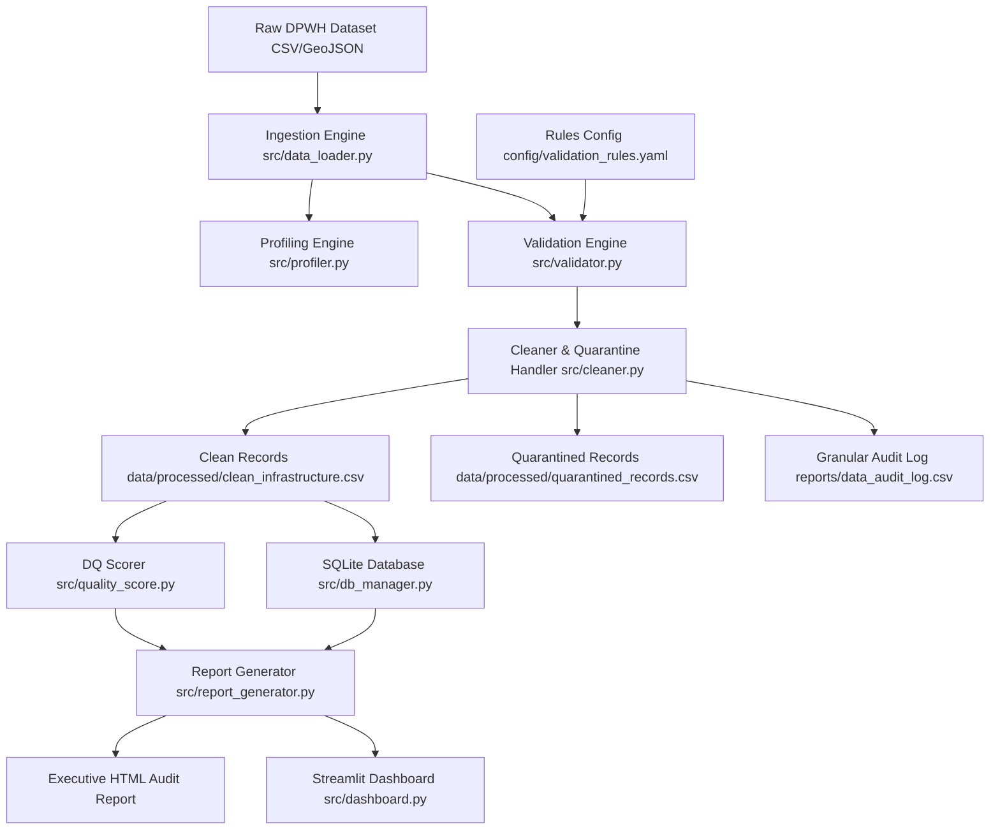

# Philippine Infrastructure Data Audit & Validation Suite 🌉

[](https://www.python.org/)
[]()
[](LICENSE)
[]()

An enterprise-grade Python data quality auditing, validation, and analytics platform engineered specifically for public infrastructure datasets in the Philippines. This platform ingests raw Department of Public Works and Highways (DPWH) National Bridge and Road inventory data, performs statistical profiling, executes multi-dimensional validation rules, isolates dirty records via a **Quarantine Pattern**, computes a composite **Data Quality Score (0–100% / Grade A–F)**, loads processed data into an **SQLite database**, and generates interactive visual dashboards and executive HTML audit reports.

---

## 🛠️ Key Features

- **Geospatial & Spatial Validation Engine**: Enforces Philippine bounding box constraints (Latitude 4.5°–21.5°N, Longitude 116.0°–127.0°E) to detect inverted, swapped, or out-of-country bridge coordinates.
- **Physical Engineering Rules**: Validates bridge structural parameters (length, width, span count, max load capacity, construction year bounds).
- **Regex & Primary Key Audit**: Enforces official DPWH identifier formats (e.g. `B03203LZ`) and flags duplicate primary keys.
- **Quarantine Pattern & Audit Trail**: Isolates dirty or corrupt records into `data/processed/quarantined_records.csv` while maintaining a granular `reports/data_audit_log.csv` detailing every anomaly and imputation.
- **Composite 5-Dimension DQ Scoring**: Evaluates datasets across 5 core dimensions:
  1. **Completeness** (25%)
  2. **Validity** (30%)
  3. **Uniqueness** (20%)
  4. **Consistency** (15%)
  5. **Timeliness** (10%)
- **Relational SQL Database Engine**: Automatically populates SQLite database (`infrastructure_audit.db`) with pre-written analytical queries (`sql/audit_queries.sql`).
- **Interactive Streamlit Web App**: Includes a live visual dashboard for spatial mapping, regional scorecards, and SQL query execution (`src/dashboard.py`).
- **Synthetic Noise Benchmark Generator**: Includes `src/synthetic_generator.py` to create controlled dirty test datasets with injected errors for rule benchmark testing.

---

## 📐 Architecture Workflow



---

## 📁 Repository Structure

```
Infrastructure Data Audit & Validation Suite/
│
├── config/
│   └── validation_rules.yaml       # Rule definitions, thresholds, DQ weightings
│
├── data/
│   ├── raw/
│   │   └── national_bridges_2021.csv # Primary real DPWH Bridge dataset (8,496 bridges)
│   ├── test/
│   │   └── dirty_bridges_sample.csv  # Synthetic benchmark dataset with known errors
│   └── processed/
│       ├── clean_infrastructure.csv  # Cleaned valid dataset
│       ├── quarantined_records.csv   # Isolated invalid records
│       └── infrastructure_audit.db   # SQLite database for SQL analytics
│
├── notebooks/
│   ├── 01_data_profiling.ipynb
│   ├── 02_data_validation.ipynb
│   ├── 03_data_cleaning.ipynb
│   └── 04_infrastructure_analysis.ipynb
│
├── reports/
│   ├── figures/                      # High-res audit charts & plots
│   ├── audit_report.csv              # Detailed audit findings per record
│   ├── data_quality_summary.csv      # Executive DQ summary table
│   └── executive_audit_report.html   # Standalone HTML executive report
│
├── sql/
│   └── audit_queries.sql             # SQL queries for regional audit & risk profiling
│
├── src/
│   ├── __init__.py
│   ├── config_loader.py             # YAML configuration parser
│   ├── data_loader.py               # Robust CSV & GeoJSON loader with type handling
│   ├── profiler.py                  # Profiling engine (missingness, stats, distributions)
│   ├── validator.py                 # Core multi-dimensional validation rules engine
│   ├── cleaner.py                   # Data cleaning, imputation, and quarantine handler
│   ├── quality_score.py             # Composite 5-dimension DQ scoring algorithm
│   ├── db_manager.py                # SQLite database ingestion & analytical query helper
│   ├── report_generator.py          # Visual chart generator & executive report compiler
│   ├── dashboard.py                 # Interactive Streamlit Web Application
│   └── synthetic_generator.py       # Dirty test data generator for rule evaluation
│
├── tests/
│   ├── test_validator.py            # Pytest suite for validation rules
│   ├── test_cleaner.py              # Pytest suite for quarantine and audit logs
│   └── test_quality_score.py       # Pytest suite for DQ score calculations
│
├── main.py                          # Full CLI entry point with command flags
├── requirements.txt                 # Project dependencies
├── README.md                        # Project documentation
└── LICENSE                          # MIT License
```

---

## 🚀 Quickstart & Setup Guide

### 1. Clone & Install Dependencies

```bash
git clone https://github.com/your-username/infrastructure-data-audit.git
cd "infrastructure-data-audit"
pip install -r requirements.txt
```

### 2. Run the Full End-to-End Audit Pipeline

Execute the full data ingestion, profiling, validation, cleaning, quality scoring, DB loading, and HTML report generation pipeline:

```bash
python main.py --all
```

### 3. Run on Synthetic Dirty Data (Testing Anomaly Detection)

Generate a 200-record synthetic benchmark dataset with injected anomalies and run the audit pipeline:

```bash
python main.py --synthetic
```

### 4. Launch Interactive Streamlit Visual Dashboard

```bash
streamlit run src/dashboard.py
```

### 5. Run Automated Unit Tests

```bash
python -m pytest tests/ -v
```

---

## 📊 Sample Execution Output

```
========================================================================
    PHILIPPINE INFRASTRUCTURE DATA AUDIT & VALIDATION SUITE
========================================================================
Loading Dataset: data/raw/national_bridges_2021.csv
Dataset Loaded: 8,496 records, 44 columns.

--- [Step 1] Data Profiling ---
Shape: 8496 rows x 44 cols
Overall Missing Cells: 8539 (2.28%)
Duplicate Primary Keys (BRIDGE_ID): 0

--- [Step 2] Validation Engine Execution ---
Records Evaluated: 8,496
Issues Detected: 79
Flagged Records: 76
Clean Records: 8,420

--- [Step 3] Data Cleaning & Quarantine Isolation ---
Clean Records Saved -> data/processed/clean_infrastructure.csv (8,458 rows)
Quarantined Records Saved -> data/processed/quarantined_records.csv (38 rows)

--- [Step 4] Composite Data Quality Scoring ---
OVERALL DATA QUALITY SCORE: 99.52%
OVERALL DATA QUALITY GRADE: A
Dimension Breakdown:
  - Completeness   : 100.0%
  - Validity       : 99.1%
  - Uniqueness     : 100.0%
  - Consistency    : 100.0%
  - Timeliness     : 97.94%
```

---

## 📜 Open Source & Dataset Attribution

- Dataset source: Department of Public Works and Highways (DPWH) Road and Bridge Inventory via OpenStreetMap Philippines ([OSMPH/dpwh_bridges](https://github.com/OSMPH/dpwh_bridges)).
- License: MIT License. See [LICENSE](LICENSE) for details.
